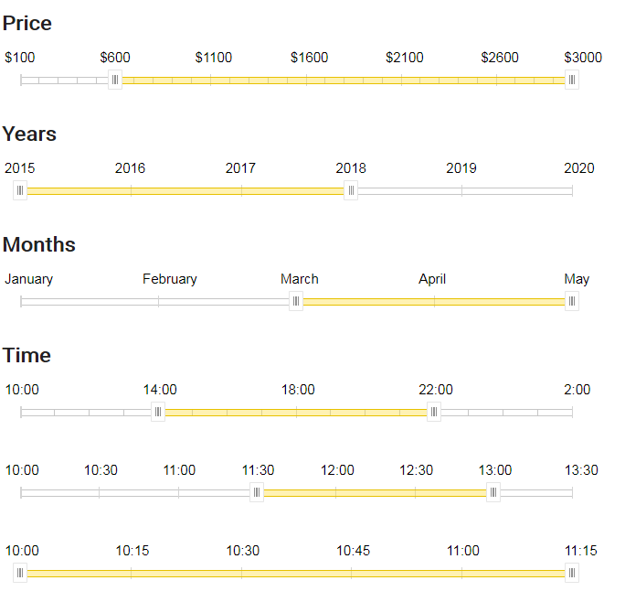

# [ Range Slider for your react app  💋 ]

RangeSlider is a React component allowing users to input numeric ranges within a specific range.

**A running demo is available [here](https://tanyaignatenko.github.io/react-range-slider/).**

## Screenshots


## Features
 * Draggable handles
 * Draggable selectedRange
 * Handles can be crossed

## Usage
````js
import React, { useState } from 'react';
import ReactDOM from 'react-dom';
import RangeSlider from 'react-range-slider';

const toPriceLabel = price => `$${price}`;

function App() {
  const [priceSelectedRange, setPriceSelectedRange] = useState({
    start: 600,
    end: 3000,
  });

  return (
    <RangeSlider
      min={100}
      max={3000}
      valuePerStep={100}
      labelMarkStep={5}
      selectedRange={priceSelectedRange}
      onChange={setPriceSelectedRange}
      formatLabel={toPriceLabel}
    />
  );
}

ReactDOM.render(<App />, document.getElementById('app'));
`````
## API

### RangeSlider props

#### min: number

Set a minimum value that can be selected

#### max: number

Set a maximum value that can be selected

#### selectedRange: { start: number, end: number }

Set current selected range. Have no effect while drag happening.

#### onChange: (range: { start: number, end: number }): void

Whenever user drags slider handles/range, this function gets called. Inside the function, you should assign a new selected range to your component.

#### formatLabel: (value: number): string

Format label of given value.

#### valuePerStep?: number

Set step to get next value from current.
Default: 1. 

#### labelMarkStep?: number

Set step per which label mark would be printed.
Default: 4. 

#### className?: string

Add className to component outermost container. 
Default: ''. 
## License

MIT
